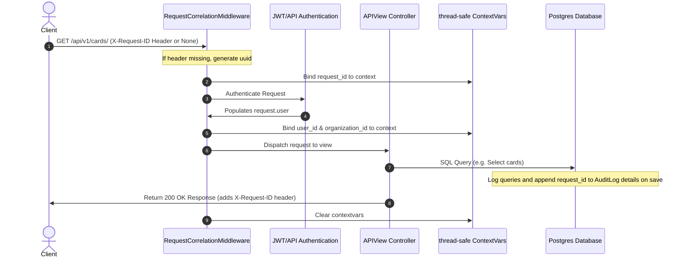
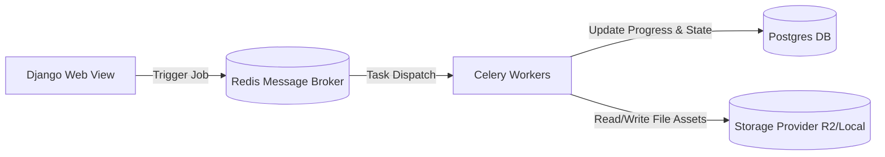
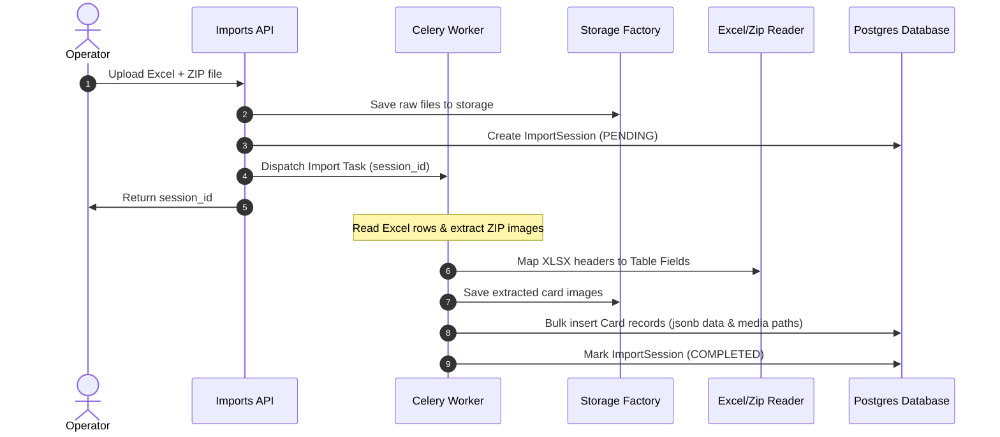
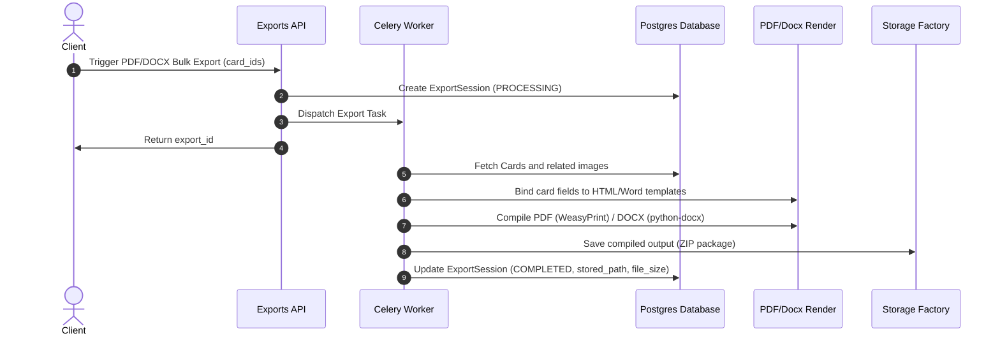
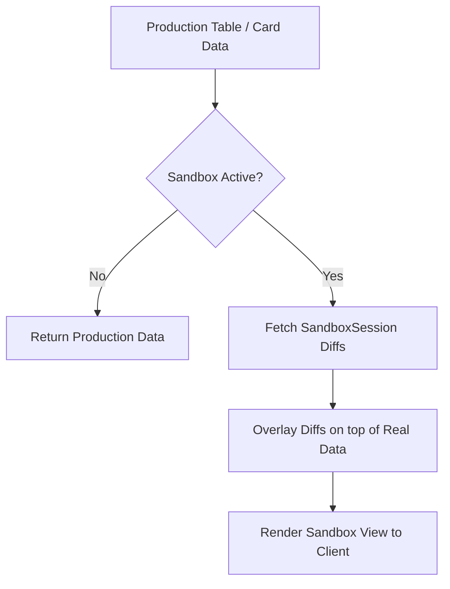
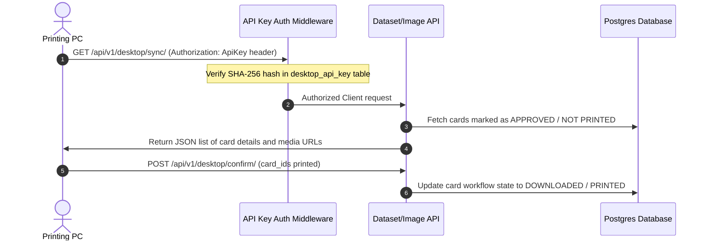
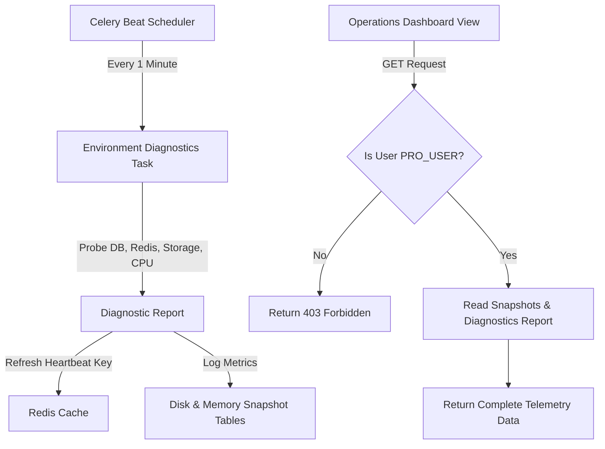

# Adarsh ID Panel: System Architecture & Data Flows

This document details the high-level architecture, service boundaries, and data flows within the Adarsh ID Panel backend platform.

---

## 1. System Overview & Boundaries

The platform is designed around **Domain-Driven Design (DDD)**. Communication between bounded contexts is strictly orchestrated using services, selector layers, or task queues to avoid circular dependencies and service leaks.

```mermaid
graph TD
    subgraph Core Bounded Context
        A[Users & Auth] --> B[Organizations]
        B --> C[Permissions]
        B --> D[Tables & Fields]
        D --> E[Cards & Media]
        E --> F[Workflow Transitions]
    end
    
    subgraph Operational & Integration Add-ons
        G[Sandbox Overlay] -.-> |Virtualizes| E
        H[Pro Platform] --> |Impersonates & Flag Overrides| Core Bounded Context
        I[Desktop API] --> |Authenticates & Prints| E
        J[Asynchronous Pipelines] --> |Imports/Exports| E
        K[Operations & DR] --> |Monitors & Backs Up| Core Bounded Context
    end
```

---

## 2. Request & Correlation Flow

Every incoming HTTP request undergoes correlation tracing to trace issues across services, logs, database writes, and background workers:



---

## 3. Background Job Flow

Asynchronous tasks are isolated into queues (e.g. `default`, `imports`, `exports`) to prevent resource starvation during batch runs:



---

## 4. Import & Processing Flow

The import pipeline handles bulk uploads by combining Excel parsing with image zip extraction:



---

## 5. Export Flow

Bulk document exports are processed in background tasks using document templates:



---

## 6. Sandbox (Overlay Architecture) Flow

The Sandbox allows clients to view a virtual state of card mutations. No production card records are duplicated or updated:



---

## 7. Desktop API & Sync Flow

The Desktop API facilitates printing cards on physical printer networks through decentralized API keys:



---

## 8. Operations Telemetry & Fail-Safe Flow

Health check diagnostics are executed continuously via Celery Beat, updating status caches and recording disk/memory logs:


