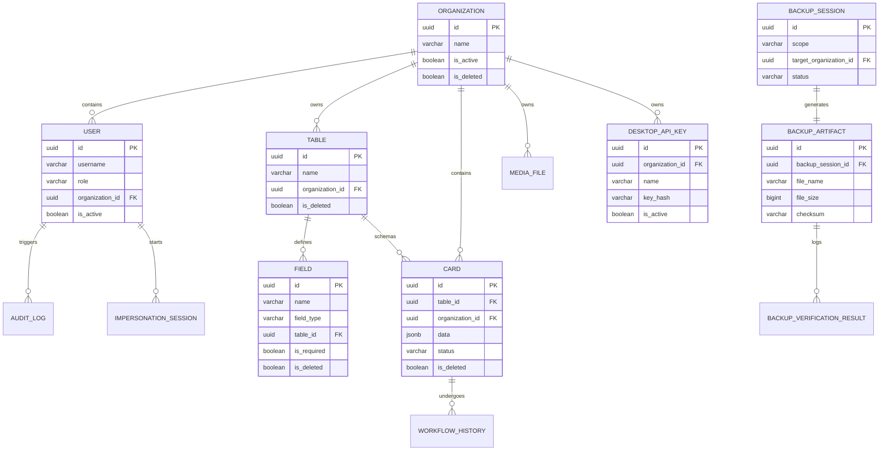

# Adarsh ID Panel: Database Schema & Entity Relationships

This document details the database schema, entity relationships, database indexes, constraints, and validation rules enforced inside PostgreSQL.

---

## 1. Entity Relationship Diagram

---

## 2. Core Constraints & Index Configurations

To ensure high-throughput query response times and data integrity, indexes and constraints are declared explicitly across all tables.

### A. Organizations & Users
- **Table Names**: `organizations_organization`, `users_user`
- **Unique Constraints**:
  - `users_user` enforces a unique constraint on `username`.
- **Database Indexes**:
  - Index on `users_user.organization_id` for tenant join lookups.

### B. Tables & Fields (Dynamic Schemas)
- **Table Names**: `tables_table`, `fields_field`
- **Unique Constraints**:
  - Unique constraint on `(organization_id, name)` for tables (preventing duplicate table profiles per tenant).
  - Unique constraint on `(table_id, name)` for fields (preventing duplicate attributes within a dynamic schema).
- **Database Indexes**:
  - Index on `tables_table.organization_id` (foreign key indexing).
  - Index on `fields_field.table_id`.

### C. Cards (Dynamic Data Store)
- **Table Name**: `cards_card`
- **JSONB Schema Validation**:
  - Card attributes are stored in a PostgreSQL `JSONB` column named `data`.
  - Service layers validate card data payloads against the dynamic `Field` records associated with the table schema before database insertion.
- **Database Indexes**:
  - Gin index on `cards_card.data` for fast schema-less JSON filtering.
  - Compound index on `(organization_id, status)` for dashboard counters and queue lists.

---

## 3. Architecture Rules

### A. Soft Delete Rules
To prevent data loss from accidental deletion actions, logical soft deletes are enforced on the following models:
- **Models**: `Organization`, `Table`, `Field`, `Card`
- **Implementation**:
  - Extends models with an `is_deleted = BooleanField(default=False)` flag.
  - Selector modules filter out records where `is_deleted=True` from default queries.
  - Hard deletions are strictly forbidden for cards and tables.

### B. Unique Constraints (Avoiding Duplication Crashes)
Under Phase 10 validation, import processes must never crash when encountering duplicate card entries.
- **Rule**:
  - Each dynamic Table specifies one or more fields as **Unique Identity Fields** (e.g. Student Registration Number, Employee ID).
  - Import scripts look up existing records by these identity fields within the current tenant boundary. If found, it performs an **update (UPSERT)** in place instead of trying to insert a new duplicate record, preventing unique constraint crash exceptions.

### C. Workflow Constraints
Card state changes are restricted to the following state rules:
- Valid states: `PENDING`, `VERIFIED`, `APPROVED`, `DOWNLOADED`.
- Transitions must follow the linear direction:
  - `PENDING` ➔ `VERIFIED` (Operator or Client)
  - `VERIFIED` ➔ `APPROVED` (Client only)
  - `APPROVED` ➔ `DOWNLOADED` (Client or automated print station/key downloader)
- A card can be demoted to `PENDING` if it fails validation or template mapping.
