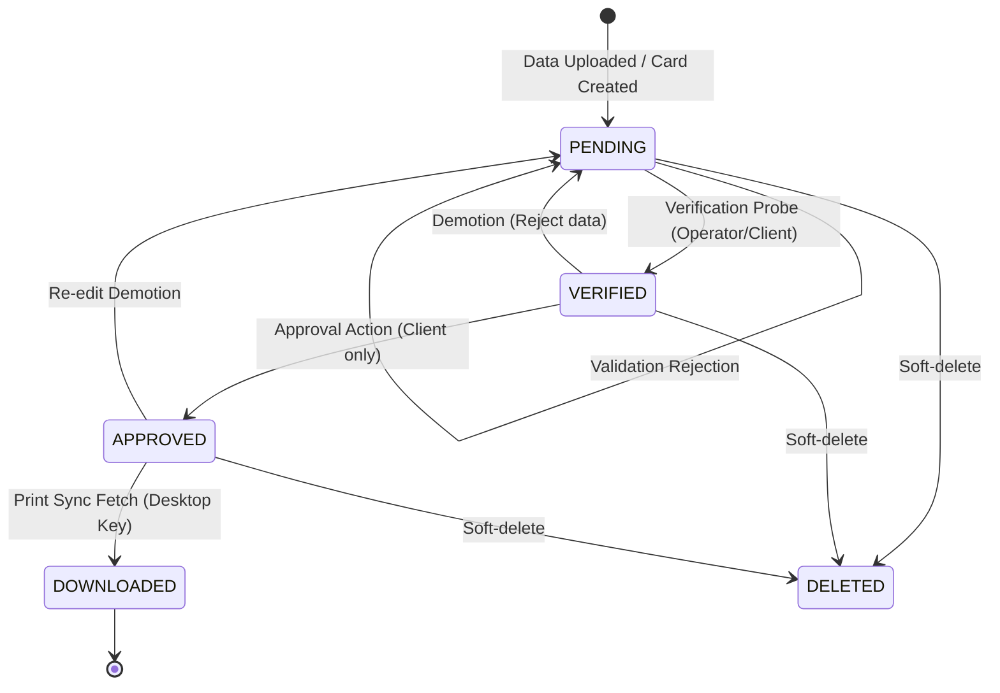

# Adarsh ID Panel: Card Workflow Lifecycle

This document defines the lifecycle states, transition validation rules, authorization requirements, and audit trail hooks of the Card Workflow engine.

---

## 1. Card State Machine

Cards progress through four primary workflow states: `PENDING`, `VERIFIED`, `APPROVED`, and `DOWNLOADED`. There is also a logical `DELETED` soft-delete state.



---

## 2. State Directory

- **`PENDING`**: 
  * Default entry state when a card is uploaded via Excel or created manually.
  * Fields may be incomplete or lack headshots.
- **`VERIFIED`**:
  * Clean data state. Card has passed all dynamic field schema validations (e.g. required regex checks, image resolution).
  * Marked as "ready for final check" by an Operator or Client.
- **`APPROVED`**:
  * Locked printing state. Card is locked against further modifications and is ready to be compiled into print documents or downloaded by local printers.
  * Transition can only be authorized by a `CLIENT` or `ADMIN`.
- **`DOWNLOADED`**:
  * Finalized state. Indicates the card has been successfully fetched and printed by a Desktop Synchronization Sync PC.

---

## 3. Transition Rules & Validations

1. **PENDING ➔ VERIFIED**:
   * **Required Role**: `OPERATOR`, `CLIENT`, `ADMIN`, or `PRO_USER`.
   * **Validation Checks**:
     * All fields marked as `is_required=True` must have non-empty values.
     * Numeric and string regex values must conform to configurations.
     * Associated Headshot image must exist in `MediaFile` registry.
2. **VERIFIED ➔ APPROVED**:
   * **Required Role**: `CLIENT`, `ADMIN`, or `PRO_USER`.
   * **Validation Checks**:
     * Verification audit log must exist.
     * Prevents double approvals or unauthorized modifications.
3. **APPROVED ➔ DOWNLOADED**:
   * **Required Role**: Authenticated print station via `DesktopApiKey` or `CLIENT`.
   * **Validation Checks**:
     * Transition triggered when cards are pulled via sync endpoints and printing completes.

---

## 4. Audit Logging Hooks

Every state change publishes an entry in `apps.auditlogs`. Each log record contains the following structure:
- `event_type`: `CARD_TRANSITION`
- `actor`: User ID of the initiator
- `details`:
  ```json
  {
    "card_id": "e8e6d2b5-bd8a-4934-be57-9f448b11c6d3",
    "from_state": "PENDING",
    "to_state": "VERIFIED",
    "transition_timestamp": "2026-06-06T12:30:15Z"
  }
  ```
This ensures complete auditability for security compliance.
