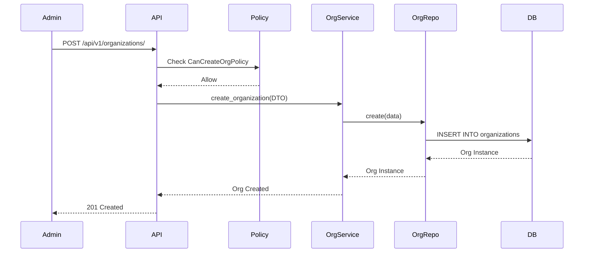

# Data Flow Documentation

## Client Creation Flow

*Flows for Operator Assignment, Table Creation, Field Creation, and Card Creation follow this identical Request -> Policy -> Service -> Repository -> DB pattern.*\n