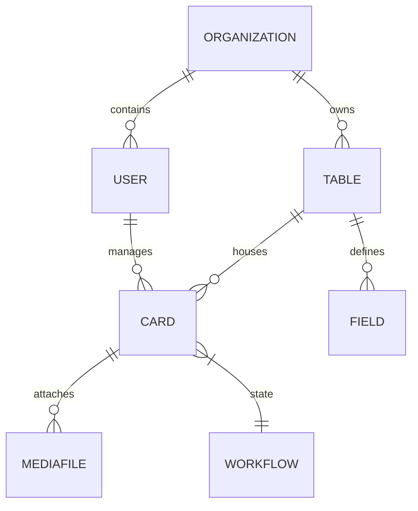

# Database Documentation

## Core Entities

## Strategy
- **Tenant Isolation**: Every core table (Table, Card, Field) has an `organization_id` foreign key.
- **Dynamic Fields**: The `Card` model utilizes a highly indexed `JSONB` column to store variable fields dictated by the `Table` definitions.
- **Indexes**: GIN indexes are applied to the JSONB columns for fast dynamic field querying.\n