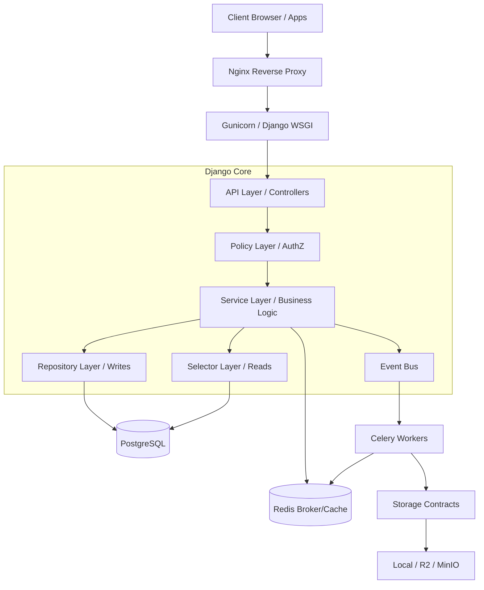

# Architecture Handbook

## Complete System Architecture

## Layer Explanations
1. **API Layer**: Receives HTTP requests. Validates inputs using DRF serializers/schemas. 
2. **Policy Layer**: Enforces access control before executing business logic. (e.g., `CanEditCardPolicy`).
3. **Service Layer**: The heart of the application. No database queries exist here; it orchestrates Repositories and Selectors.
4. **Repository Layer**: The ONLY layer allowed to mutate database state (`.save()`, `.create()`, `.update()`).
5. **Selector Layer**: The ONLY layer allowed to read from the database (`.filter()`, `.get()`). Returns ORM instances or DTOs.
6. **Infrastructure/Contracts**: Wraps third-party integrations (Storage, AWS, MinIO, Email) into interchangeable interfaces.\n