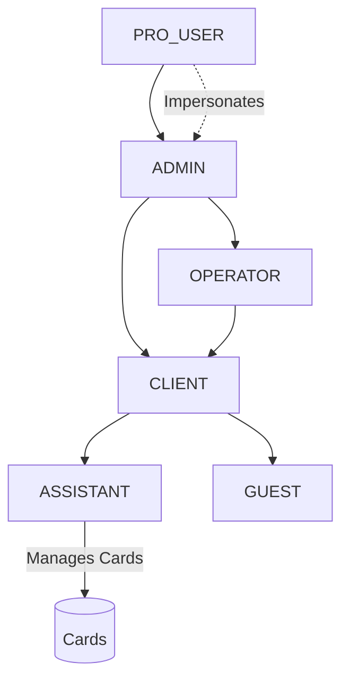

# User Hierarchy Documentation

### Hierarchy Rules
1. **PRO_USER**: Superuser. Maintains infrastructure. Can impersonate anyone.
2. **ADMIN**: Tenant Owner. Full control over an Organization.
3. **OPERATOR**: Staff. Manages Clients on behalf of the Admin.
4. **CLIENT**: Customer. Owns Tables and workflows.
5. **ASSISTANT**: Data entry worker. Can only edit assigned cards.
6. **GUEST**: Read-only tracking access.\n