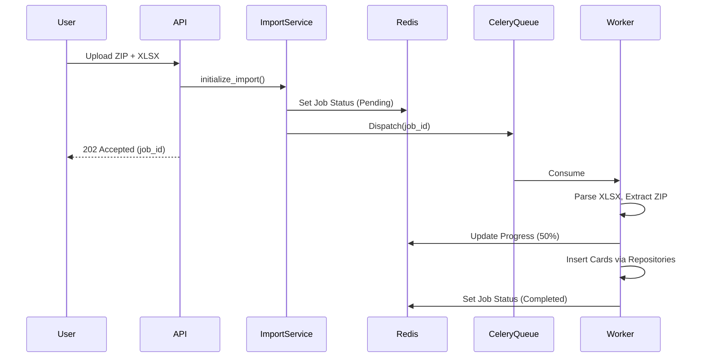

# Import & Export Pipeline

## Import Architecture

## Export Architecture (PDF/DOCX)
- Uses `WeasyPrint` for high-fidelity PDFs.
- Flow: `API Request` -> `Job Created` -> `Worker fetches Cards` -> `Renders Template` -> `Uploads to Storage` -> `Notifies User`.\n