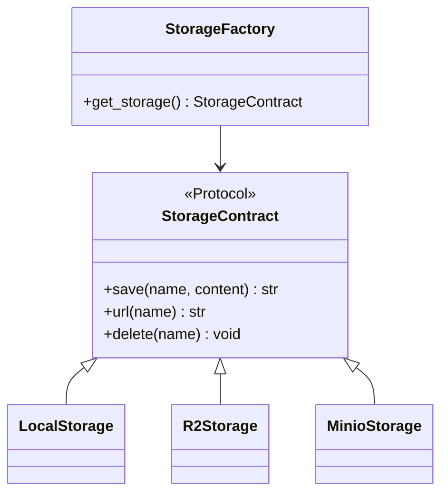

# Storage Architecture

The system utilizes a Strategy Pattern for storage.

```mermaid
classDiagram
    class StorageContract {
        <<Protocol>>
        +save(name, content) str
        +url(name) str
        +delete(name) void
    }
    class LocalStorage
    class R2Storage
    class MinioStorage
    class StorageFactory {
        +get_storage() StorageContract
    }
    
    StorageContract <|-- LocalStorage
    StorageContract <|-- R2Storage
    StorageContract <|-- MinioStorage
    StorageFactory --> StorageContract
```
- Instantiation is handled via `StorageFactory.get_storage()` configured by `.env` (`STORAGE_BACKEND`).\n